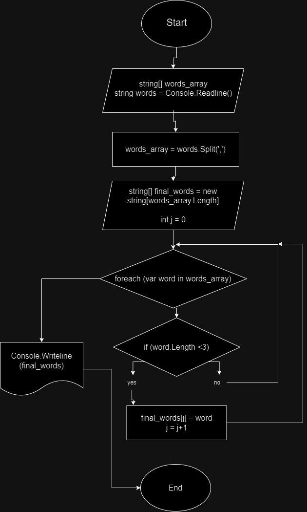

## Описание решения: 
Блок-схема решения:

1) В начале объявляем пустой массив words_array.
2) Считываем строку нужных слов через запятую и сохраняем в words.
3) при помощи string.Split разделяем строку words на подстроки из слов, и сохраняем в виде массива из подстрок в words_array.
4) Создаём новый массив строк final_words, в котором будут храниться финальные значения. Его размер будет равен размеру words_array. Создаём переменную j для индексирования новых значений. 
5) Создаём цикл foreach, где для каждого элемента массива words_array будет выполняться операция if. 
6) Используя string.Length узнаём длину каждого элемента words_array, и если она меньше 3-х, то элемент переходит в новый массив final_words.
7) Далее, используя string.Join, объединяем значения массива final_words через запятую в одну строку, а затем выводим в консоли.